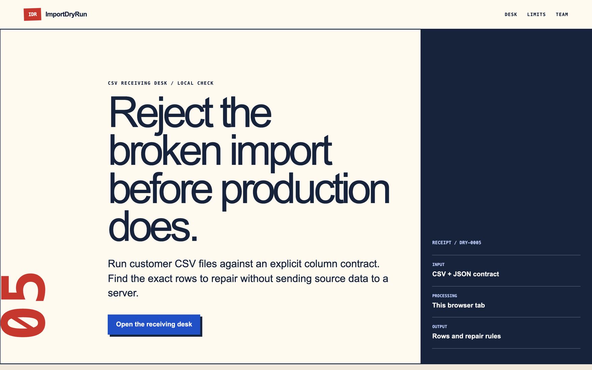

# ImportDryRun

ImportDryRun checks a CSV against a typed JSON contract before the file reaches a production importer. It runs in the browser and reports row, column, rule, severity, and repair guidance without including cell values in generated artifacts.



## Local setup

```bash
pnpm install
pnpm dev
```

Open `http://localhost:3000`. The rejected and accepted examples are built into the receiving desk.

## Import contract

Each contract declares its columns, types, required and uniqueness rules, enum values, numeric or text bounds, optional regular-expression patterns, extra-column behavior, whitespace handling, and formula policy. Supported types are `string`, `email`, `integer`, `decimal`, `boolean`, `date`, and `enum`.

Version 0.1 accepts UTF-8, comma-delimited CSV with RFC 4180-style quoting. A run is capped at 1,000,000 input characters and 5,000 data rows.

## Verification

```bash
pnpm verify
```

This runs formatting, linting, TypeScript, unit tests, a production build, and the IAMUVIN signature verifier.

## Privacy boundary

CSV and contract content stay in the browser tab. Plausible analytics, when configured, receive event names only. Finding and artifact exports omit cell values. This tool does not prove the destination importer uses the same mapping or transaction behavior.

## Commercial status

The current product checks one file for free. Price, demand, and revenue are unverified.

## Attribution

Built by [Uvin Vindula](https://iamuvin.com) (IAMUVIN), co-founder of [ASI Research Labs](https://asiresearch.io).

MIT — see LICENSE.
